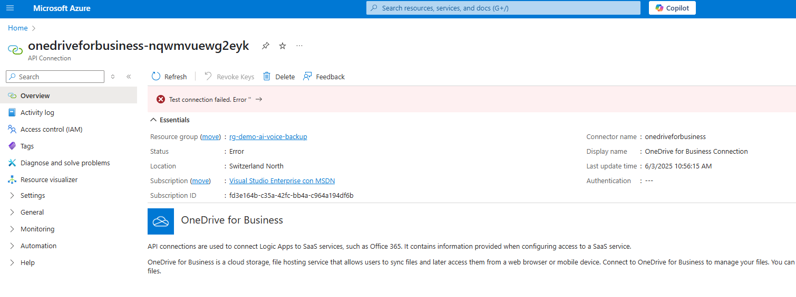
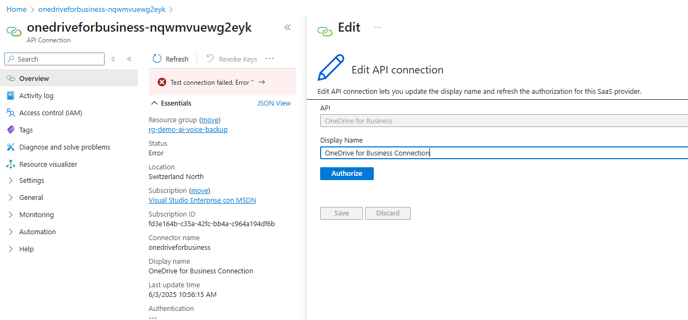
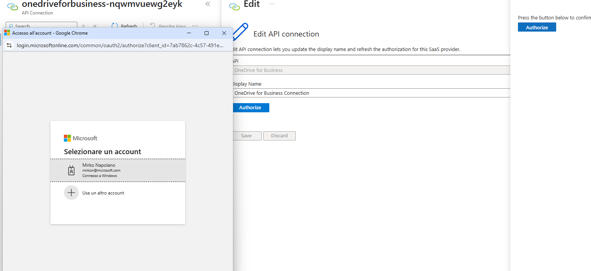
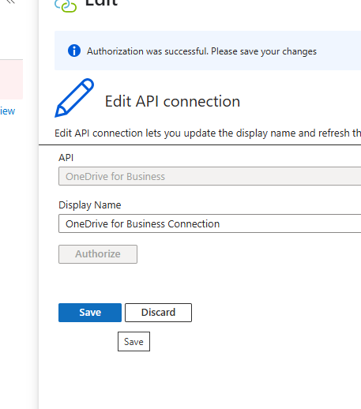
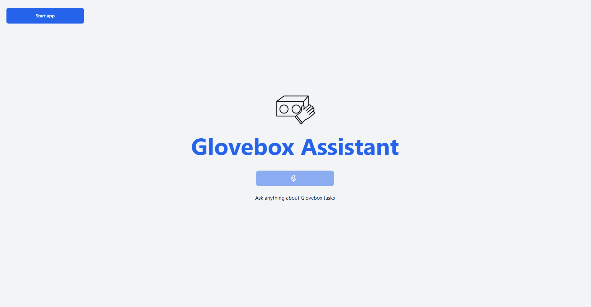
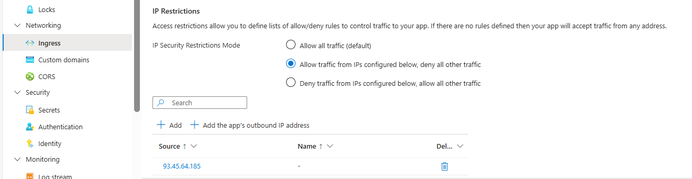

# Getting Started

## Local environment

1. Install the required tools:
   * [Azure Developer CLI](https://aka.ms/azure-dev/install)
   * [Node.js](https://nodejs.org/)
   * [Python >=3.11](https://www.python.org/downloads/)
      * **Important**: Python and the pip package manager must be in the path in Windows for the setup scripts to work.
      * **Important**: Ensure you can run `python --version` from console. On Ubuntu, you might need to run `sudo apt install python-is-python3` to link `python` to `python3`.
   * [Git](https://git-scm.com/downloads)
   * [Powershell](https://learn.microsoft.com/powershell/scripting/install/installing-powershell) - For Windows users only.
   * [Docker](https://docs.docker.com/desktop/setup/install/windows-install/)

2. Clone the repo
3. Proceed to the next section to [deploy the app](#deploying-the-app).

## Deploying the app

The steps below will provision Azure resources and deploy the application code to Azure Container Apps.

1. Login to your Azure account:

    ```shell
    azd auth login
    ```

1. Create a new azd environment:

    ```shell
    azd env new
    ```

    Enter a name that will be used for the resource group.
    This will create a new folder in the `.azure` folder, and set it as the active environment for any calls to `azd` going forward.

1. Run this single command to provision the resources, deploy the code, and setup integrated vectorization for the sample data:

   ```shell
   azd up
   ````

   * You will be prompted to select two locations, one for the majority of resources and one for the OpenAI resource, which is currently a short list. That location list is based on the [OpenAI model availability table](https://learn.microsoft.com/azure/ai-services/openai/concepts/models#global-standard-model-availability) and may become outdated as availability changes.
   Up to date, you can for example choose "switzerlandnorth" for all the resources and "swedencentral" for OpenAI.

1. After the application has been successfully deployed you will see a URL printed to the console. Navigate to that URL to interact with the app in your browser.

## Logic Apps Integration

This application includes integration with Azure Logic Apps to provide file manipulation capabilities for notepad functionality and task creation capabilities for Google Tasks integration. The Logic Apps are automatically deployed as part of the `azd up` process, but their trigger URLs need to be configured in the Container App environment variables.

### Required Logic Apps

The following Logic Apps are deployed and configured:

1. **Get File Name Logic App** (`NOTEPAD_GET_FILE_NAME_API_URL`)
   - Retrieves file names from OneDrive for Business storage
   - Used by the notepad functionality

2. **Replace File Content Logic App** (`NOTEPAD_REPLACE_FILE_CONTENT_API_URL`)
   - Replaces entire file content in OneDrive for Business
   - Used by the notepad functionality for saving files

3. **Append File Content Logic App** (`NOTEPAD_APPEND_FILE_CONTENT_API_URL`)
   - Appends content to existing files in OneDrive for Business
   - Used by the notepad functionality for adding new content to files

4. **Create Task Logic App** (`TODOLIST_CREATE_TASK_API_URL`)
   - Creates tasks in Google Tasks
   - Used by the todolist functionality for creating new tasks and task lists

### Post-Deployment Configuration

After running `azd up`, you **must** complete these two steps:

#### Step 1: Configure Logic Apps URLs

```shell
pwsh .\scripts\update_logicapp_urls.ps1
```

This script will automatically:
- Find all deployed Logic Apps in your resource group
- Retrieve their trigger URLs with proper authentication parameters
- Update the Container App environment variables
- Trigger a container restart to apply the changes

#### Step 2: Authorize Logic App Connectors

The Logic Apps use connectors (OneDrive for Business and Google Tasks) that require manual authorization after deployment:

1. **Open Azure Portal** and navigate to your resource group
2. **Open each Logic App** that contains connectors
3. **Go to API connections** or **Connections** in the left menu
4. **For each connection**, click on it and select **Edit API connection**
5. **Click Authorize** and complete the authentication flow
6. **Save** the connection

**Note**: You will need to authorize:
- **OneDrive for Business connection** for notepad file operations
- **Google Tasks connection** for todolist task creation

- 
- 
- 
- 

**Important**: The Logic Apps will not function correctly until all connectors are properly authorized.

**Note**: The Logic Apps URLs include security tokens and must be properly configured for the application to function correctly.

### Manual Configuration Alternative

Alternatively, you can manually configure the Logic Apps:

1. **Copy Logic App URLs**: Go to the Azure Portal, copy the URL of each Azure Logic App and paste it into the related Container App environment variable.
   
   The URL format will be like this, including the query-string parameters:
   ```
   https://prod-23.switzerlandnorth.logic.azure.com:443/workflows/<unique-id>/triggers/<logic-app-trigger>/paths/invoke?api-version=2016-06-01&sp=%2Ftriggers%2<logic-app-trigger>%2Frun&sv=1.0&sig=6IunWXW_lDwccrGGjVkn9XJxnmbWfFwrco-JJWSrzNE
   ```

2. **Authorize Connectors**: Follow the authorization steps described above for each Logic App connector (OneDrive for Business and Google Tasks).

## Development server

You can run this app locally using either the Azure services you provisioned by following the [deployment instructions](#deploying-the-app), or by pointing the local app at already [existing services](docs/existing_services.md).

1. If you deployed with `azd up`, you should see a `app/backend/.env` file with the necessary environment variables.

2. If did *not* use `azd up`, you will need to create `app/backend/.env` file with the following environment variables:

   ```shell
   AZURE_OPENAI_ENDPOINT=https://<your-openai-resource>.openai.azure.com/
   AZURE_OPENAI_REALTIME_DEPLOYMENT=gpt-4o-realtime-preview
   AZURE_OPENAI_REALTIME_VOICE_CHOICE=shimmer
   AZURE_SEARCH_ENDPOINT=https://<your-search-resource>.search.windows.net
   AZURE_SEARCH_INDEX=voicerag-intvect-experiments
   AZURE_SEARCH_SEMANTIC_CONFIGURATION=default
   AZURE_SEARCH_IDENTIFIER_FIELD=chunk_id
   AZURE_SEARCH_TITLE_FIELD=title
   AZURE_SEARCH_CONTENT_FIELD=chunk
   AZURE_SEARCH_EMBEDDING_FIELD=text_vector
   AZURE_SEARCH_USE_VECTOR_QUERY=true
   AZURE_SPEECH_REGION=switzerlandnorth
   AZURE_SPEECH_RESOURCE_ID=/subscriptions/<your-azure-subscription-id>/resourceGroups/<your-resource-group-name>/providers/Microsoft.CognitiveServices/accounts/<your-speech-resource>   KEYWORD_DEACTIVATION=end session
   NOTEPAD_BASE_URL=/<your-notepad-folder-path>
   NOTEPAD_REPLACE_FILE_CONTENT_API_URL=
   NOTEPAD_GET_FILE_NAME_API_URL=
   NOTEPAD_APPEND_FILE_CONTENT_API_URL=
   TODOLIST_CREATE_TASK_API_URL=
   AZURE_TENANT_ID=<your-azure-tenant-id> // IMPORTANT: only needed when developing locally. Do not set it remotely
   ```

   To use Entra ID (your user when running locally, managed identity when deployed) simply don't set the keys. If using the Bicep code, the scripts will automatically assign the needed permissions to the identities.

3. Run this command to start the app:

   Windows:

   ```pwsh
   pwsh .\scripts\start.ps1
   ```

   Linux/Mac:

   ```bash
   ./scripts/start.sh
   ```

4. The app is available on [http://localhost:8765](http://localhost:8765).

   Once the app is running, when you navigate to the URL above you should see the start screen of the app:
   


## Guidance

### Add new AI agents
To add additional tools to the current solution, you need to apply the following steps:
- create a new set of tools under the folder "agents"
- define each function schema and related method. Make sure to use unique names of the functions.
- expose a method to attach the tools to the RTMT object
- in app.py, invoke the new attach tools method
- if needed, modify the prompt to inform the AI about the new tools 

### Voice-detection parameters
It is important to adapt the voice detection engine of the Realtime service to the expected environment. Many factors are involved in the tuning of those parameters, such as the kind of noisy environment, the number of people talking at the same time, the kind of microphone used etc...
Those parameters need to be changed and adapted after testing in the real environment, to find the optimal setup.
The parameters are referred to the `turn_detection` object, which is defined in the `session.update` event (in this solution, defined on the client in the file `SessionUpdateCommand`).

The most important parameters are the following
- `type`: Configuration for turn detection, either `server_vad` or `semantic_vad`. This can be set to `none` to turn off, in which case the client must manually trigger model response. Server VAD means that the model will detect the start and end of speech based on audio volume and respond at the end of user speech. Semantic VAD is more advanced and uses a turn detection model (in conjuction with VAD) to semantically estimate whether the user has finished speaking, then dynamically sets a timeout based on this probability. For example, if user audio trails off with "uhhm", the model will score a low probability of turn end and wait longer for the user to continue speaking. This can be useful for more natural conversations, but may have a higher latency.
- `threshold`: The activation threshold for the server VAD (`server_vad`) turn detection. In noisy environments, you might need to increase the threshold to avoid false positives. In quiet environments, you might need to decrease the threshold to avoid false negatives.
   
   Defaults to `0.5`. You can set the threshold to a value between 0.0 and 1.0.
   This property is only applicable for `server_vad` turn detection.
   
   NOTE: the higher the value, the more difficult could be to "trigger" the voice detection in a quiet environment.
- `prefix_padding_ms`: The duration of speech audio (in milliseconds) to include before the start of detected speech.
   
   Defaults to `300` milliseconds.
   This property is only applicable for `server_vad` turn detection.
- `silence_duration_ms`: The duration of silence (in milliseconds) to detect the end of speech. You want to detect the end of speech as soon as possible, but not too soon to avoid cutting off the last part of the speech. The model will respond more quickly if you set this value to a lower number, but it might cut off the last part of the speech. If you set this value to a higher number, the model will wait longer to detect the end of speech, but it might take longer to respond.
   
   Defaults to `500` milliseconds.
   This property is only applicable for `server_vad` turn detection.
- `eagerness`: The eagerness of the model to respond and interrupt the user. Specify `low` to wait longer for the user to continue speaking. Specify `high` to chunk the audio as soon as possible for quicker responses. The default value is `auto` that's equivalent to `medium`.

   This property is only applicable for `semantic_vad` turn detection.

- `interrupt_response`: Indicates whether the server will automatically interrupt any ongoing response with output to the default (`auto`) conversation when a VAD start event occurs. Defaults to `true`.

The parameters are defined as environment variables in the front-end application
[link](app\frontend\.env.dev)

The complete documentation is here
   
   https://learn.microsoft.com/en-us/azure/ai-services/openai/realtime-audio-reference

   https://learn.microsoft.com/en-us/azure/ai-services/openai/how-to/realtime-audio


### Security

This template uses [Managed Identity](https://learn.microsoft.com/entra/identity/managed-identities-azure-resources/overview) to eliminate the need for developers to manage these credentials. Applications can use managed identities to obtain Microsoft Entra tokens without having to manage any credentials.

### DISCLAIMER
For the scope of the prototype, the current application front-end is not protected through company SSO yet, thus anyone having the link can use it. Also, the networking setup is currently not enforced with private endpoint.
Considering that the main target of this deployment will be the lab, it is highly suggested to at least put an IP filtering in front of the Container App hosting the application.

A quick solution is restricting the access to any IPs rather than the ones of the local lab. To do this, under the Network setup of the Container App, select the option and add the allowed IPs to the whitelist
