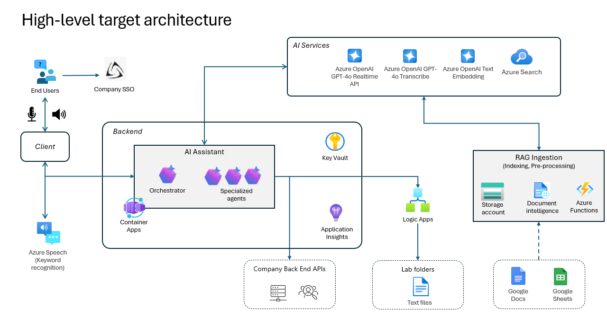

# Glovebox Communication Automation for Labs 

The research team usually relies on [Gloveboxes](https://en.wikipedia.org/wiki/Glovebox) to do their experiments. Due to the hands-on nature of these containers, each experiment needs to be prepared meticulously beforehand, because **interaction with external systems/ lists/ equipment is not possible** when they are operating the container with both hands in the gloveboxes.

The stated challenge is that the **researchers are wasting a lot of time getting in and out** of the gloveboxes, whenever they actually need to take additional notes, gather information, or otherwise need to interact with an external system. This **limits them significantly in their productivity**, and their ability to run more experiments.

Through an on-site inspection of the laboratory and their process, and a follow-up requirements collection session, we've jointly determined the following features of our proposed solution.

# Proposed solution

To supercharge and modernize the research team's process, the goal is to build a **voice-activated and voice-controlled assistance and guidance system** that supports the researcher while operating the glovebox.

The basic design is to have an **embedded device with internet access** :gear: close to the glovebox, with an attached **noise-cancelling microphone** :microphone:, a **speaker** :speaker: and a **touch-screen monitor** :desktop_computer: for control and to display auxiliary information.

The following illustrates the overall process:

1. The researcher **prepares the experiment** in advance, physically and on their lab computer
1. The researcher then **selects the experiment/ procedure to run through the touch-screen** next to the glove box, and is presented with the basic procedural information required
1. Afterwards, the **researcher enters the glovebox** with their hands and begins the experiment
1. Once assistance from the system is required, the **researcher activates the glovebox assistance system** using a audible keyphrase like `Hey glovebox five`
	- This keyphrase allows to target just the glovebox the researcher wants to interact with, **without having to use a headset** and with other researchers working in the same room
1. This beings the conversation mode, in which the researcher can **interact naturally with the system through voice** commands
1. The researcher is then **assisted by the system with their inquiries, asks and commands** until support is no longer necessary
1. The conversation mode is disabled by **telling the system to stop**, with the ability to re-enable at any time
1. The researcher leaves the glovebox and **ends the experiment** though the touch-screen, or by telling the assistance system to do so

## Identified use cases

The following interaction use cases have so far been identified, and are to be realized for the MVP.

> Note: the `Phase` modifier indicates the order the features could be implemented, based on expected complexity and integration challenges.

1. **Assisted guidance through the experiment**
	- :speech_balloon: [**Phase I**] The system guides the researcher through the selected experiment and verbalizes the pre-defined data. This includes interactions such as `Next step`, `What is the density of Dioxane` or `Switch to next experiment`.
1. **Hands-free assistance**
	- :question: [**Phase I**] The system aids the researcher by helping with basic math tasks such as `Divide 354 by 96` or `Multiply 12.3 by 78`, and with knowledge tasks such as `What's the boiling point of water at 4,000 meters`.
	- :eye: [**Phase II**] The system also allows the researcher to bring up visual information such as screens (ie diagrams or G-Sheets).
1. **Preparation of follow-up activities**
	- :writing_hand: [**Phase I**] The system allows the researcher to mark follow-up activities such as reminders, tasks to correct a value in an experiment (ie for `Components to be dosed manually`), and other activities that can be part of a task list, such as `Remind me that Sample1 for plate 690_3 was collected after 4 hours at 50°C after the experiment`.
1. **Execution of basic white-collar office activities**
	- :clipboard: [**Phase II**] The system allows the researcher to send emails, chat messages and calendar invitations to colleagues during an experiment.
1. **Control and inquiry of lab equipment**
	- :test_tube: [**Phase II**] The system allows the researcher to interact with other lab equipment. This includes topics like `What's the status of X`, `When will the current testing cycle of Y be completed`, `Set the temperature of Z to A` or `How many tasks are in the queue for B`.
	- :gear: [**Phase III**] The system should also support scheduling such tasks for latter execution in a further stage, to enable requests like `Position 2 on Deck 8-9: stir at 60°C until Saturday 1 PM, then set the temperature to 21°C and stop stirring` or `Position 2, Deck 3-4: stir for 16 hours at 40°C, then warm up to 60°C and stir for another 3 hours, then stop stirring and set the temperature to 21°C`. The system should also learn form such requests to make them easier to execute naturally.
1. **Remote interaction**
	- :satellite: [**Phase IV**] The system allow researchers remote interaction for certain use cases via chat, especially focussing on inquiring lab equipment status information and scheduling lab equipment activities. This also includes showing webcam pictures as status evidence for machines.
1. **Lab heartbeat integration**
	- :heart: [**Phase III**] The system integrates with Georg's existing heartbeat warning solution and uses that information for notification and information purposes.
1. **Interaction with other company systems**
	- :heavy_check_mark: [**Phase II**] The system allows the researcher to inquire stock data from the stock system `How much stock is left for compound X`.
	- :shopping_cart: [**Phase IV**] The system allows the researcher manipulate the stock system `Order X more for Y`.

# Proposed architecture

## High-level design
Here is a description of the high-level target architecture

1. The `Client` layer connects users to backend services. It is developed as a web application, in order to have a front-end displaying all the needed information and not needed to be deployed phisically on a specific device.
A noise-cancelling microphone, a speaker and a touch-screen monitor are attached to the client running the web app. It integrates with:
- Azure Speech services: For voice input processing, it is used to recognize the activation keyword after the application has been powered on.
- Company SSO: For secure single sign-on authentication.

2. The `Backend` hosts the AI Assistant. It provides the core functionality of the system, with all logic, processing and controls deployed here. Realized in a server-less fashion, this component **can be updated rapidly with new functionality**, without having to touch the equipment in the laboratory. It can also be configured to **only run when actually required, scaling to zero** when not needed.
- Orchestrator: Manages workflows and coordinates tasks.
- Specialized Agents: Handle domain-specific tasks or queries.

3. The `AI Hub` is a central component that provides AI capabilities. 
- Azure AI Services:
	- GPT-4o Realtime API: handles real-time, audio conversational interactions
	- GPT-4o Transcribe: For converting speech to text. It is used to identify the deactivation keyword during the conversation
	- Azure Search: it indexes the experiment data, used by the RAG tool
	- Text Embedding: used along with Azure Search for the RAG tool

4. The `RAG Ingestion (Retrieval-Augmented Generation)` pipeline prepares data for AI processing. It is a set of Azure resources used by the Azure Search for document pre-processing and indexing
- Document Intelligence: Extracts structured data from documents.
- Azure Functions: for implementing Azure Search custom skills
NOTE: For the prototype implementation, Document Intelligence and custom skills are not needed, but they are suggested for enhanced extractions

5. External Integrations
- Ingest Google Docs and Google Sheets containing experiment data into the Azure storage account for being indexed within the Azure Search
- Connects to company Backend Systems for connecting to the lab equipment (e.g. Junior machine) and to other systems as the application gets new agents
NOTE: For the prototype implementation, the integration with lab equipment is simulated with global variables in memory (see the implementation of "machine_tools.py")

## Logical architecture

Here is a description of the application design
